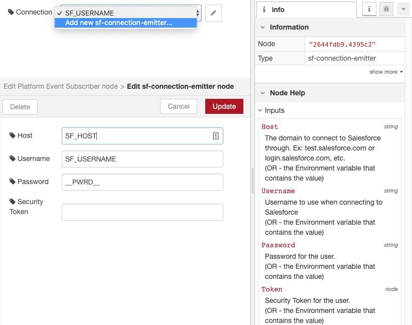
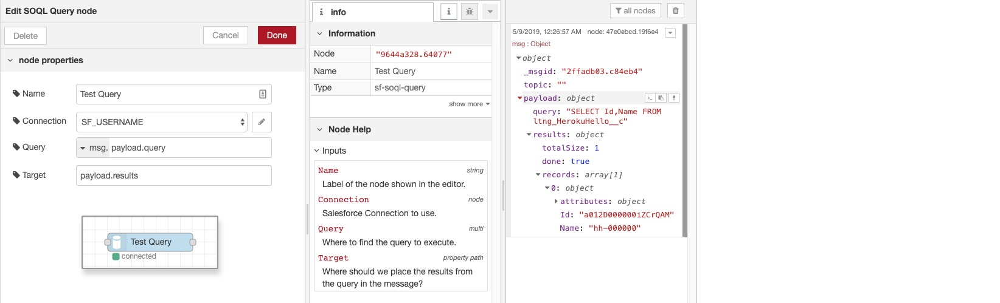
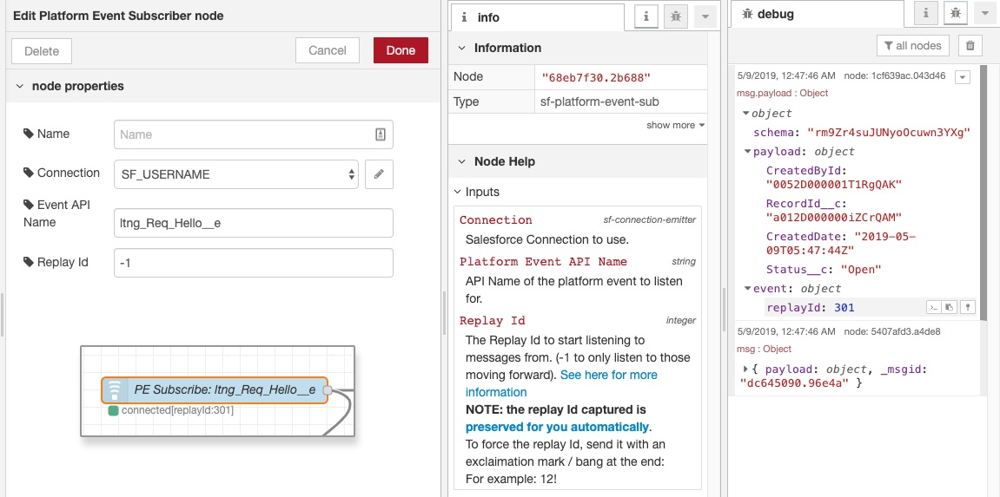
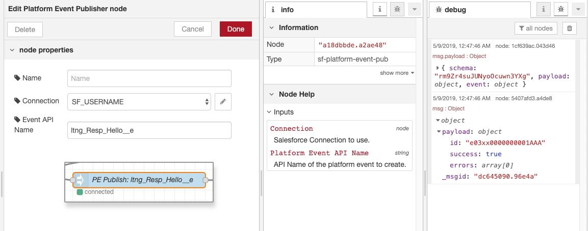
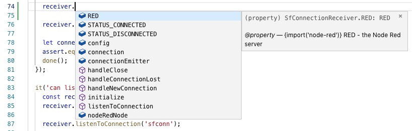
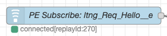

# Overview

A set of Node Red commands that allows nodes to better connect to salesforce (using environment variables, connection pools and config nodes).

Many of the connections we have seen for Salesforce rely on creating a configuration node to store the credentials.  This is then used by the various other nodes to connect to salesforce - each with their own connection.

We would instead like to ensure the following:

* Credentials are secured using best practices
  * While explicitly stating credentials to the config / resulting JSON is sill allowed, environment variables are now also supported. (Providing greater reusability, support for heroku and security)
* Connections are established at the Connection Credential and emitted to those dependent.
  * Child nodes can get notified of the current connection, when it is disconnected or request it be reset through events.
* Support for ES6 Classes and subclassing
  * By providing classes that can be extended, listening for the events can become quite simple.

# Nodes

## [connection.SfConnectionEmitter](./nodes/connection/sf-connection-emitter.js)

**Configuration Node** - used by most (if not all of the other Salesforce commands.

When other nodes specify their type as `sf-connection-emitter`, then a drop-down dialog allows them to choose which configuration to use.

Each configuration manages the connection to salesforce, and emits events to those listening when:

* (newConnection) - a connection is established
* (connectionLost) - the connection has been disconnected
* (refresh) - the connection should be restarted (logout and re-established)
* (logout) - request the connection be severed

For nodes that subclass the [connection.SfConnectionReceiver](./nodes/connection/sf-connection-receiver) - this is all handled for you... For more information, [please see that class](./nodes/connection/sf-connection-receiver)

### Configuration

<table>
	<thead>
		<tr>
			<th>Name</th>
			<th>Type</th>
			<th>Description</th>
			<th>Example</th>
		</tr>
	</thead>
	<tbody>
		<tr>
			<td>Name</td>
			<td>String</td>
			<td>Label to show in Node Red Editor</td>
			<td>SF Connection</td>
		</tr>
		<tr>
			<td>Host</td>
			<td>string</td>
			<td>Domain to login with  
				OR name of environment variable
			</td>
			<td>https://test.salesforce.com 
				or test.salesforce.com  
				or login.salesforce.com  
				or SF_HOST
			</td>
		</tr>
		<tr>
			<td>Password</td>
			<td>string</td>
			<td>Password for that user  
				OR name of environment variable  
				(note: token does not use environment variable, so include in password if using environment variable)
			</td>
			<td>t0tallyVALID!  
				or t0talyVALID!0abcd  
				or SF_PASSWORD
			</td>
		</tr>
		<tr>
			<td>Security Token</td>
			<td>string</td>
			<td><a href='https://help.salesforce.com/articleView?id=user_security_token.htm&r=https%3A%2F%2Fwww.google.com%2F&type=5'>Security Token for user</a></td>
			<td>0abcd</td>
		</tr>
	</tbody>
</table>

### Events

The SfConnectionEmitter dispatches four types of events, automatically handled by the 

Each configuration manages the connection to salesforce, and emits events to those listening when:

* (newConnection) - a connection is established
* (connectionLost) - the connection has been disconnected
* (refresh) - the connection should be restarted (logout and re-established)
* (logout) - request the connection be severed

For nodes that subclass the [connection.SfConnectionReceiver](./nodes/connection/sf-connection-receiver) - this is all handled for you... For more information, [please see that class](./nodes/connection/sf-connection-receiver)

## [query.SfSoqlQuery](./nodes/query/sf-soql-query)

Use this node to perform a SOQL query to capture information from Salesforce

<table>
	<thead>
		<tr>
			<th>Name</th>
			<th>Type</th>
			<th>Description</th>
			<th>Example</th>
		</tr>
	</thead>
	<tbody>
		<tr>
			<td>Name</td>
			<td>String</td>
			<td>Label to show in Node Red Editor</td>
			<td>Query</td>
		</tr>
		<tr>
			<td>Connection</td>
			<td> connection.SfConnectionEmitter</td>
			<td>The connection emitter configuration to use</td>
			<td>sfconn</td>
		</tr>
		<tr>
			<td>Query</td>
			<td>msg property | global variable | string | environment variable </td>
			<td>The query to execute. (msg property is recommended, as a template can easily help here)</td>
			<td>msg.info.query</td>
		</tr>
		<tr>
			<td>Target</td>
			<td>msg property</td>
			<td>The path on the msg to put the results</td>
			<td>payload.results</td>
		</tr>
	</tbody>
</table>

## [platformEvents.SfPlatformEventSubscriber](./nodes/platformEvents/sf-platform-event-sub)

Use this to listen to <a href='https://developer.salesforce.com/docs/atlas.en-us.platform_events.meta/platform_events/platform_events_intro.htm'>Salesforce Platform Events</a>

More on Platform Events can also be [found on Trailhead.Salesforce.com](https://trailhead.salesforce.com/en/content/learn/modules/platform_events_basics)

<table>
	<thead>
		<tr>
			<th>Name</th>
			<th>Type</th>
			<th>Description</th>
			<th>Example</th>
		</tr>
	</thead>
	<tbody>
		<tr>
			<td>Name</td>
			<td>String</td>
			<td>Label to show in Node Red Editor</td>
			<td>PE Subscription</td>
		</tr>
		<tr>
			<td>Connection</td>
			<td> connection.SfConnectionEmitter</td>
			<td>The connection emitter configuration to use</td>
			<td>sfconn</td>
		</tr>
		<tr>
			<td>Event API Name</td>
			<td>string</td>
			<td>Platform Event Object API Name</td>
			<td>ltng_Hello__e</td>
		</tr>
		<tr>
			<td></td>
			<td></td>
			<td>The Replay Id to start listening to messages from. 
				(-1 to only listen to those moving forward).
				<a href='https://developer.salesforce.com/docs/atlas.en-us.api_streaming.meta/api_streaming/using_streaming_api_durability.htm'>See here for more information</a>   
				<b>NOTE: the replay Id captured is preserved for you automatically.</b> 
To force the replay Id, configure it with an exclaimation mark / bang at the end:
For example: 12!</td>
			<td></td>
		</tr>
	</tbody>
</table>

As mentioned above, the replay Id captured is preserved for you automatically.

Note that this is preserved to be only visible to that same node, as opposed to the flow or within the whole project. [Please see Node Red's documentation on Node Context for more](https://nodered.org/docs/creating-nodes/context)

While this is a decent stop-gap, future work will allow it to be stored to external services (such as a Redis store).
 
To force the replay Id, configure it with an exclaimation mark / bang at the end:
For example: 12!

## [platformEvents.SfPlatformEventPublisher](./nodes/platformEvents/sf-platform-event-pub)

Use this to publish <a href='https://developer.salesforce.com/docs/atlas.en-us.platform_events.meta/platform_events/platform_events_intro.htm'>Salesforce Platform Events</a>

Simply apply the object you want to publish as the msg.payload and it will handle the rest.

More on Platform Events can also be [found on Trailhead.Salesforce.com](https://trailhead.salesforce.com/en/content/learn/modules/platform_events_basics)

<table>
	<thead>
		<tr>
			<th>Name</th>
			<th>Type</th>
			<th>Description</th>
			<th>Example</th>
		</tr>
	</thead>
	<tbody>
	<tbody>
		<tr>
			<td>Name</td>
			<td>String</td>
			<td>Label to show in Node Red Editor</td>
			<td>PE Subscription</td>
		</tr>
		<tr>
			<td>Connection</td>
			<td> connection.SfConnectionEmitter</td>
			<td>The connection emitter configuration to use</td>
			<td>sfconn</td>
		</tr>
		<tr>
			<td>Event API Name</td>
			<td>string</td>
			<td>Platform Event Object API Name</td>
			<td>ltng_Hello__e</td>
		</tr>
	</tbody>
</table>

# Extending

While the request to use ES6 classes is currently underway within Node-Red modules, the following is the current structure for the nodes:

All nodes can be found by importing the module:

* connection
	* [SfConnectionEmitter](./nodes/connection/sf-connection-emitter.js)
	* [SfConnectionReceiver](./nodes/connection/sf-connection-receiver)
* query
	* [SfSoqlQuery](./nodes/query/sf-soql-query)
* platformEvents
	* [SfPlatformEventPublisher](./nodes/platformEvents/sf-platform-event-pub)
	* [SfPlatformEventSubscriber](./nodes/platformEvents/sf-platform-event-sub)

Note that Node-Red gets access to the setupNodeRed function,
using require(...) directly gives access to the es6 class.

Also note, although NodeRed does not support TypeScript, care has been taken to support jsdoc / intellisense - to make extending these modules easier...

## [connection.SfConnectionReceiver](./nodes/connection/sf-connection-receiver)

Base Class for many of the other commands.

Note that this provides a couple convenience functions, such as setting the status and base methods for listening to newConnection and connectionLost events.

Simply override the handleNewConnection(JsForceConnection) and handleConnectionLost(JsForceConnection) methods - respectively...

### Properties

<table>
	<thead>
		<tr>
			<th>Name</th>
			<th>Type</th>
			<th>Description</th>
			<th>Example</th>
		</tr>
	</thead>
	<tbody>
		<tr>
			<td>RED</td>
			<td><a href='https://github.com/DefinitelyTyped/DefinitelyTyped/blob/master/types/node-red/index.d.ts#L16'>@types/node-red#Red</a></td>
			<td>Node Red instance - captured during initialization</td>
			<td></td>
		</tr>
		<tr>
			<td>config</td>
			<td>object</td>
			<td>Configuration passed to the node from the node red editor</td>
			<td>{name:'query',query:'...'}</td>
		</tr>
		<tr>
			<td>nodeRedNode</td>
			<td><a href='https://github.com/DefinitelyTyped/DefinitelyTyped/blob/master/types/node-red/index.d.ts#L42'>@types/node-red#Node</td>
			<td>Node Red Node instance to be manipulated</td>
			<td></td>
		</tr>
		<tr>
			<td>connectionEmitter</td>
			<td>Node Red Config Id</td>
			<td>The connection emitter configuration to use</td>
			<td>sfconn</td>
		</tr>
		<tr>
			<td>STATUS_CONNECTED</td>
			<td>string</td>
			<td>Use this with the #status(string) command to set the status on the node</td>
			<td></td>
		</tr>
		<tr>
			<td>STATUS_DISCONNECTED</td>
			<td>string</td>
			<td>Use this with the #status(string) command to set the status on the node</td>
			<td></td>
		</tr>
	</tbody>
</table>

### initialize

Intitialize the node

<table>
	<thead>
		<tr>
			<th>Name</th>
			<th>Type</th>
			<th>Description</th>
			<th>Example</th>
		</tr>
	</thead>
	<tbody>
		<tr>
			<td>RED</td>
			<td><a href='https://github.com/DefinitelyTyped/DefinitelyTyped/blob/master/types/node-red/index.d.ts#L16'>@types/node-red#Red</a></td>
			<td>Node Red instance - captured during initialization</td>
			<td></td>
		</tr>
		<tr>
			<td>config</td>
			<td>object</td>
			<td>Configuration passed to the node from the node red editor</td>
			<td>{name:'query',query:'...'}</td>
		</tr>
		<tr>
			<td>nodeRedNode</td>
			<td><a href='https://github.com/DefinitelyTyped/DefinitelyTyped/blob/master/types/node-red/index.d.ts#L42'>@types/node-red#Node</td>
			<td>Node Red Node instance to be manipulated</td>
			<td></td>
		</tr>
	</tbody>
</table>

Returns the instance, to support chaining...

### listenToConnection

Starts listening to a single salesforce connection emitter...

Just give it the name of the property on the connection that holds the value,
it will figure out the rest.

<table>
	<thead>
		<tr>
			<th>Name</th>
			<th>Type</th>
			<th>Description</th>
			<th>Example</th>
		</tr>
	</thead>
	<tbody>
		<tr>
			<td>connectionPropName</td>
			<td>String</td>
			<td>The property of the connection to check the value for</td>
			<td>sfconn</td>
		</tr>
	</tbody>
</table>

Returns void

### setStatus

Sets the status on the node

<table>
	<thead>
		<tr>
			<th>Name</th>
			<th>Type</th>
			<th>Description</th>
			<th>Example</th>
		</tr>
	</thead>
	<tbody>
		<tr>
			<td>status</td>
			<td>string</td>
			<td>STATUS_CONNECTED|STATUS_DISCONNECTED</td>
			<td></td>
		</tr>
	</tbody>
</table>

Sets the status on the node so it appears connected or disconnected...

### handleNewConnection

Overwrite this method to get notified when a connection is established.

(note that existing connections can be compared and so can also be disconnected,
or see handleConnectionLost method below)

<table>
	<thead>
		<tr>
			<th>Name</th>
			<th>Type</th>
			<th>Description</th>
			<th>Example</th>
		</tr>
	</thead>
	<tbody>
		<tr>
			<td>connection</td>
			<td><a href='https://github.com/DefinitelyTyped/DefinitelyTyped/blob/master/types/jsforce/connection.d.ts'>JSForce.Connection</a></td>
			<td>The new connection established</td>
			<td></td>
		</tr>
	</tbody>
</table>

### handleConnectionLost

Overwrite this method to get notified when the connection is lost.

(This will always get called before handleNewConnection on a connectionEmitter#refresh event)

<table>
	<thead>
		<tr>
			<th>Name</th>
			<th>Type</th>
			<th>Description</th>
			<th>Example</th>
		</tr>
	</thead>
	<tbody>
		<tr>
			<td>connection</td>
			<td><a href='https://github.com/DefinitelyTyped/DefinitelyTyped/blob/master/types/jsforce/connection.d.ts'>JSForce.Connection</a></td>
			<td>The new connection established</td>
			<td></td>
		</tr>
	</tbody>
</table>

---

## Subclassing

For example: to access the ConnectionReceiver (for subclassing), use the following:

	const connectionEmitter = require('node-red-contrib-salesforce-connection-emitter');
	const SfConnectionReceiver = connectionEmitter.connection.SfConnectionReceiver;
	//-- or directly through destructuring
	const {connection: {SfConnectionReceiver}} = require('node-red-contrib-salesforce-connection-emitter');
	
	class MyClass extends SfConnectionReceiver {...}
	
one further example - changing the name of the class:

	const {connection: {SfConnectionReceiver:ConnectionReceiver}} = require('node-red-contrib-salesforce-connection-emitter');
	
	class MyClass extends ConnectionReceiver {...}

## Running Tests
* To test the project run `npm run test` or `npm run test:watch` to continuously test.

## Running Linter
* To run linters on the project, run `npm run lint` or `npm run lint:watch` to continously lint.

# Further

* [Event Emitter](https://nodejs.org/api/events.html#events_class_eventemitter) - to support listening for connections
* [Resliliant streaming with updates available in jsforce - per Mars Hall](https://blog.heroku.com/reactive-programming-salesforce-data)
* [Alternative approach - node-red-contrib-salesforce-platform-event](https://flows.nodered.org/node/node-red-contrib-salesforce-platform-event)
* [Platform Event Considerations](https://developer.salesforce.com/docs/atlas.en-us.platform_events.meta/platform_events/platform_event_extras.htm)
* [JSForce](https://jsforce.github.io/)
* [Streaming API / Replay Extensions for JSForce](https://github.com/jsforce/jsforce/pull/740)